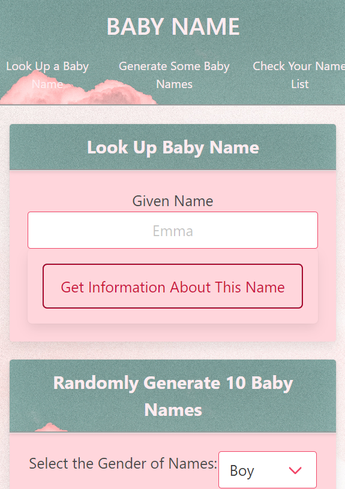

# Baby Name Application

## Description

The group behind this project had a vision to create a dynamic/all encompasing baby name generator.
We created this github repository/page for all the expecting parents.
This webpage seeks to actively provide parent(s) with suitable name for their future children along with comprehensive information regarding that name.
Across the creation of this page, we had built up an extensive knowledge of bulma, jQuery, html, css and javascript. Along with facilitating a healthy and productive team/work enviorment.

## Installation

N/A

## Table of Contents

- [Usage](#usage)
- [Sreenshots](#Sreenshots)
- [WebsiteLink](#WebsiteLink)
- [Credits](#credits)
- [Technologies](#Technologies)

## Usage

* The nav bar at the top of the page will auto scroll to the corresponding card. 

* Within the first card, Look Up Baby Name, there is a box where you can input the name.

* Once you have inputted a name, click the corresponding button beneath it for information regarding the name to show in the dynamic content box on the right side of the screen.

* The second card allows the user to randomly generator 10 baby names, along with setting parameters for the gender of the names using the drop down menu and a checkbox if you want popular names.

* Once your desired parameters have been set, click the corresponding button beneath.

* For all the baby names displayed on the screen, you can click add button to add it to your wish list.

* The final card is for the wish list. When you click the button, all the names that you added to your list from the previous cards are displayed on the right side of the screen.

* You can click the remove button to delete any baby name from your wish list.

## Sreenshots

The following images demonstrates the application appearance: 

Desktop 

Mobile 

## WebsiteLink

https://xybai0103.github.io/babyNameApp/

## Credits

https://github.com/xybai0103 
https://github.com/Palejrey 
https://github.com/rnutall

## Technologies
* [jQuery](https://jquery.com/)
* [Bulma](https://bulma.io/)
* [Baby Names API](https://api-ninjas.com/api/babynames)
* [Behind the Name API](https://www.behindthename.com/api/help.php)

## Licencse

N/A

